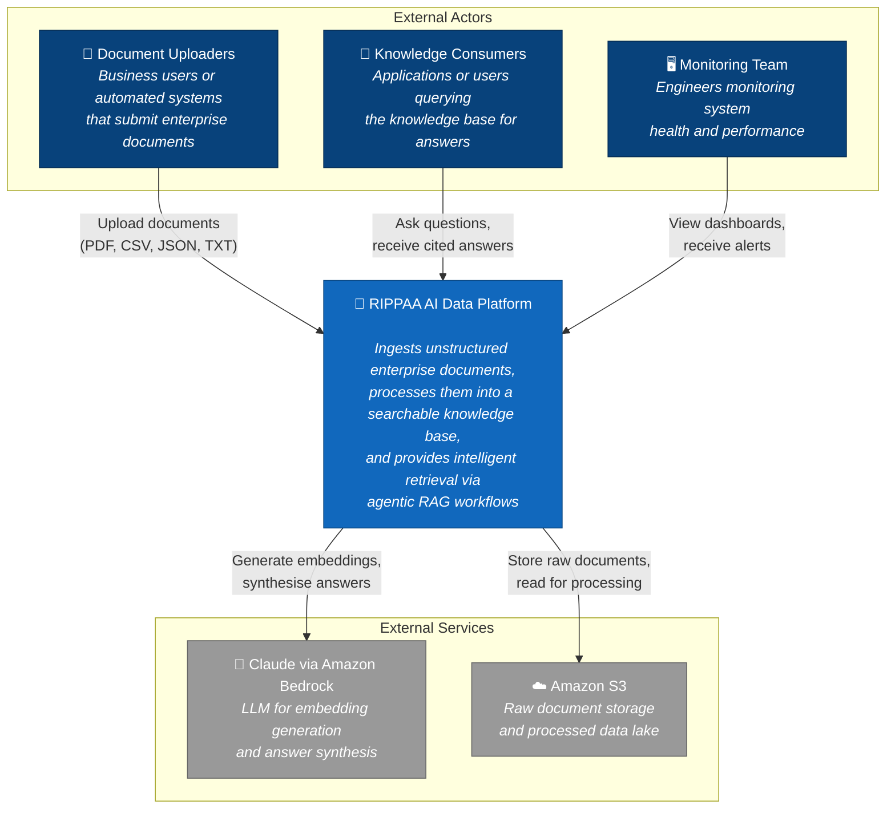

# C4 Level 1 — System Context Diagram

> Shows the RIPPAA AI Data Platform as a whole and how it interacts with external actors.

## Description

The RIPPAA AI Data Platform is an enterprise data system that:

1. **Receives** unstructured documents from business users or automated systems across four domains: insurance, financial services, government, and enterprise
2. **Processes** them through a pipeline that parses, chunks, detects PII, and generates vector embeddings
3. **Stores** the processed data in a searchable knowledge base
4. **Answers** questions from knowledge consumers using an agentic RAG system that retrieves relevant information and synthesises cited answers
5. **Reports** system health, performance metrics, and data quality to the monitoring team

External dependencies:
- **Claude via Amazon Bedrock** — Provides LLM capabilities for embedding generation and answer synthesis
- **Amazon S3** — Persistent storage for raw documents and processed data
