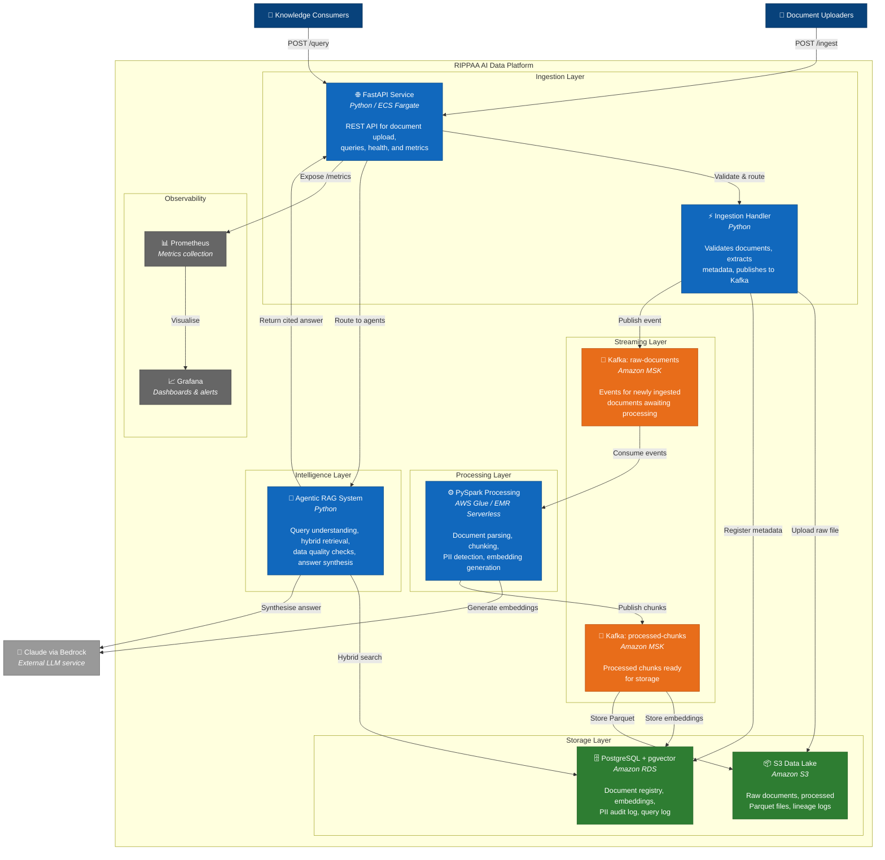

# C4 Level 2 — Container Diagram

> Shows the major containers (services, data stores, applications) within the RIPPAA AI Data Platform.

## Data Flows

### 1. Document Ingestion Flow
1. Document Uploaders submit files via `POST /ingest` to the FastAPI service
2. The Ingestion Handler validates the file, uploads it to S3, registers metadata in PostgreSQL
3. An event is published to the `raw-documents` Kafka topic

### 2. Document Processing Flow
1. PySpark jobs consume events from `raw-documents`
2. For each document: parse → chunk → detect PII → generate embeddings (via Claude/Bedrock)
3. Processed chunks are published to `processed-chunks` Kafka topic
4. A consumer stores embeddings in pgvector and processed files in S3

### 3. Query Flow
1. Knowledge Consumers submit questions via `POST /query`
2. The Agentic RAG system orchestrates four agents:
   - **Query Understanding Agent** — Classifies intent and rewrites the query
   - **Retrieval Agent** — Executes hybrid search (vector + keyword) against pgvector
   - **Data Quality Agent** — Validates source freshness and detects conflicts
   - **Synthesis Agent** — Generates a cited answer using Claude
3. The response is returned with source references

### 4. Observability Flow
1. FastAPI exposes Prometheus metrics at `/metrics`
2. Prometheus scrapes metrics every 15 seconds
3. Grafana dashboards visualise request latency, throughput, and system health

## Container Technologies

| Container | Technology | Deployment |
|---|---|---|
| FastAPI Service | Python 3.12, FastAPI, Uvicorn | ECS Fargate |
| Ingestion Handler | Python 3.12 | Part of API service (Phase 1) |
| Kafka Topics | Apache Kafka | Amazon MSK Serverless |
| PySpark Processing | PySpark 3.5 | AWS Glue / EMR Serverless |
| Agentic RAG System | Python 3.12, Claude API | Part of API service |
| PostgreSQL + pgvector | PostgreSQL 16, pgvector | Amazon RDS |
| S3 Data Lake | Amazon S3 | AWS S3 |
| Prometheus | Prometheus | Self-hosted / Amazon Managed Prometheus |
| Grafana | Grafana | Self-hosted / Amazon Managed Grafana |
