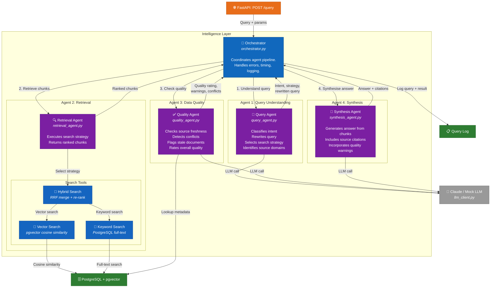

# C4 Level 3 — Component Diagram: Intelligence Layer (Agentic RAG)

> Shows the internal components of the agentic RAG system.



## Agent Pipeline Flow

```
User Query
    │
    ▼
┌─────────────────────────────────────────┐
│  Orchestrator                           │
│                                         │
│  1. Query Understanding Agent           │
│     ├── Classify intent                 │
│     ├── Rewrite query for retrieval     │
│     ├── Select strategy (hybrid/vector) │
│     └── Identify source domains         │
│                                         │
│  2. Retrieval Agent                     │
│     ├── Vector search (pgvector)        │
│     ├── Keyword search (full-text)      │
│     └── Hybrid merge (RRF re-ranking)   │
│                                         │
│  3. Data Quality Agent                  │
│     ├── Check source freshness          │
│     ├── Detect conflicting info         │
│     └── Rate overall quality            │
│                                         │
│  4. Synthesis Agent                     │
│     ├── Generate answer from chunks     │
│     ├── Include source citations        │
│     └── Add quality warnings            │
│                                         │
│  Log to query_log table                 │
└─────────────────────────────────────────┘
    │
    ▼
Answer + Sources + Metadata
```

## Component Details

### Orchestrator (`orchestrator.py`)
- Entry point: `run_query(query, max_results, source_domains)`
- Sequential execution with per-agent timing
- Error handling: if any agent fails, returns error response without crashing
- Logs complete query lifecycle to `query_log` table

### Query Understanding Agent (`query_agent.py`)
- Uses LLM to analyse the query
- Outputs: intent (information_retrieval, comparison, factual), rewritten query, search strategy (hybrid, vector, keyword), key terms, source domain suggestions
- In mock mode: returns sensible defaults without LLM call

### Retrieval Agent (`retrieval_agent.py`)
- Delegates to search tools based on strategy from query agent
- Hybrid mode: runs both vector and keyword search, merges with RRF
- Returns top N chunks with relevance scores

### Search Tools (`tools/search.py`)
- **Vector search**: pgvector cosine similarity with `<=>` operator
- **Keyword search**: PostgreSQL `to_tsvector` / `plainto_tsquery` with `ts_rank`
- **Hybrid search**: Reciprocal Rank Fusion (k=60, vector weight 0.6, keyword weight 0.4)

### Data Quality Agent (`quality_agent.py`)
- Checks each source document's ingestion date for freshness
- Uses LLM to detect conflicting information across chunks
- Rates overall quality: good, acceptable, or poor
- Returns warnings for stale or conflicting sources

### Synthesis Agent (`synthesis_agent.py`)
- Constructs prompt with query, chunks, and quality warnings
- LLM generates natural language answer with source citations
- In mock mode: returns template response summarising the retrieval

### LLM Client (`llm_client.py`)
- Abstraction layer for LLM calls
- Mock mode: returns template responses when no API key configured
- Production mode: calls Claude via Anthropic API or Bedrock
- All calls logged with timing
