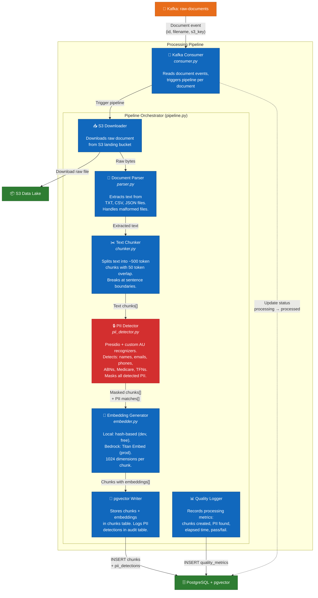

# C4 Level 3 — Component Diagram: Processing Layer

> Shows the internal components of the document processing pipeline.



## Component Details

### Kafka Consumer (`consumer.py`)
- Subscribes to `raw-documents` topic
- Consumer group: `rippaa-processors`
- Auto-offset reset: `earliest` (processes all unread messages)
- Handles graceful shutdown via signal handlers
- Supports bounded mode (`--max-messages`) for testing

### Document Parser (`parser.py`)
- **TXT**: Returns content as-is
- **CSV**: Converts rows to `key: value | key: value` format. Handles malformed CSVs (extra columns, missing values) by skipping bad rows
- **JSON**: Recursively flattens nested structures into `path.to.key: value` format
- Raises `ParseError` for unrecoverable issues — pipeline catches and logs these

### Text Chunker (`chunker.py`)
- **Fixed-size strategy**: 500 tokens (~2000 chars) with 50 token overlap
- Break-point priority: sentence boundary > paragraph > newline > word > exact position
- Produces chunks with metadata: index, text, token count, character offsets
- Short documents (under chunk size) produce a single chunk

### PII Detector (`pii_detector.py`)
- **Presidio mode**: Uses AnalyzerEngine with custom Australian recognizers
- **Regex fallback**: Works when Presidio/spaCy models unavailable
- Custom entity types: `AU_ABN`, `AU_MEDICARE`, `AU_TFN`, `AU_PHONE`
- Confidence threshold: 0.7 (configurable)
- Masking: replaces PII with typed tokens (`[EMAIL_REDACTED]`, `[ABN_REDACTED]`, etc.)

### Embedding Generator (`embedder.py`)
- **Local mode**: Deterministic hash-based embeddings (SHA-512 → 1024 float vector). Free, fast, consistent. Not semantically meaningful — for pipeline testing only.
- **Bedrock mode**: Amazon Titan Embed Text v2. Production-quality semantic embeddings. 1024 dimensions.
- Mode selected via config: local for development, Bedrock for production

### pgvector Writer (in `pipeline.py`)
- Stores each chunk with its embedding in the `chunks` table
- Embedding stored as `vector(1024)` type with IVFFlat index for similarity search
- PII detections logged in `pii_detections` table with original and masked text
- Processing metrics logged in `quality_metrics` table

## Data Flow Summary

```
Document Event (Kafka)
    → Download from S3
    → Parse (TXT/CSV/JSON → plain text)
    → Chunk (500 tokens, 50 overlap, sentence breaks)
    → Detect PII (Presidio + AU recognizers)
    → Mask PII ([EMAIL_REDACTED], [ABN_REDACTED], ...)
    → Generate Embedding (local hash or Bedrock Titan)
    → Store in pgvector (chunks + embeddings + PII audit)
    → Log Quality Metrics (pass/fail, timing, counts)
```
